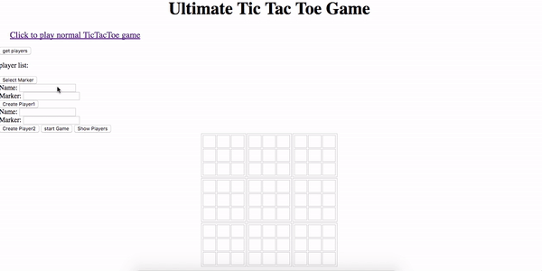
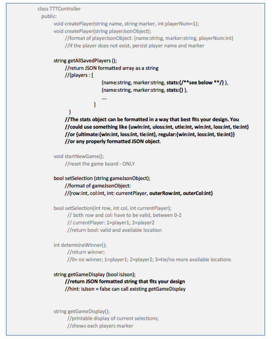

# Project Title

ULTIMATE TIC-TAC-TOE
A more complex Tic Tac Toe game implemented in C++ followed with MVC framework and other design principles.

## Description
Implemented a Tic Tac Toe game the allows players to input selections via a command-line. This program will follow the Model-View-Controller framework and make use of Object-Oriented Design Principles. This game allows player input via a graphical user interface (GUI) and to save player information. The GUI is presented in a browser and constructed using HTML, CSS, and JavaScript only. Data exchanged between the GUI and server will be in JSON format. Data access class(es) will persist player information in a file format. 

### Model
This includes wins, losses, ties for regular and ultimate Tic Tac Toe separately. For example, when on the Ultimate Tic Tac Toe view, the view will show the player’s name, how many wins, losses, ties, etc. he/she has for Ultimate Tic Tac Toe.

### View
• An option for a player to select the regular or ultimate version. Both are to work.
• Display of player names and statistics for specific game.
• When a game is selected, it shows the player with the most wins for that game.

### Controller

